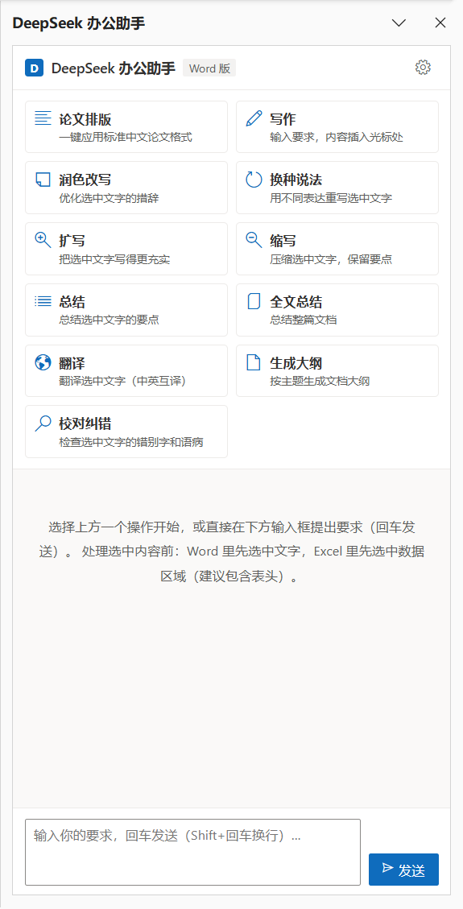
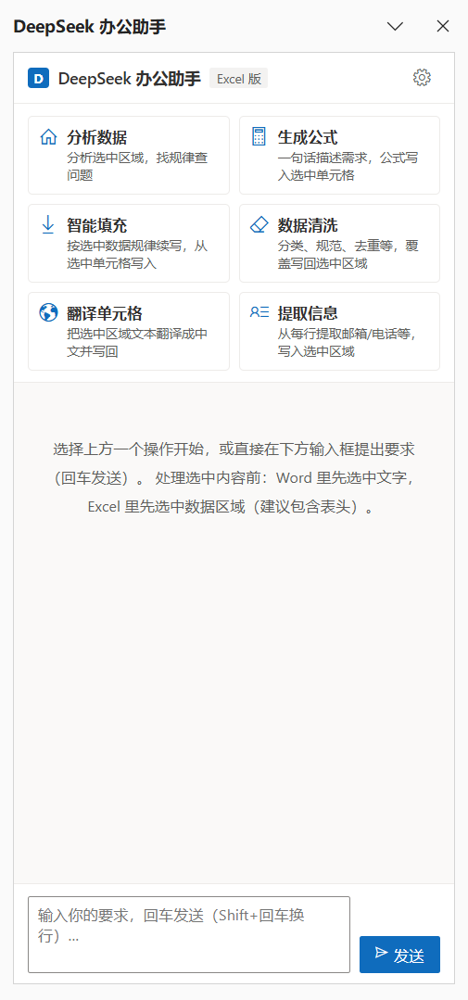

# DeepSeek 办公助手（Word / Excel 加载项）

一个内嵌到 Microsoft Word 和 Excel 的 AI 办公插件：在文档 / 表格里选中内容，一键让 DeepSeek 帮你写作、改写、总结、翻译、分析数据、生成公式，并把结果直接写回文档。同一个插件自动适配 Word 和 Excel 两种宿主。

**技术要点**：Office Add-ins（office.js）+ 本地 Node HTTPS 服务（托管页面 + 转发 DeepSeek API）。无需公网服务器、无需上架商店，API Key 只保存在本机。

## 功能一览

### Word

- **论文排版**：一键把整篇文档套用标准中文论文格式（本地直接排版，不消耗 AI；自动识别 Markdown 标题/关键词等结构）
- **AI 写作**：输入要求，内容直接插入光标处
- **润色改写 / 换种说法 / 扩写 / 缩写 / 总结 / 翻译**
- **全文总结 / 生成大纲 / 校对纠错**
- **结构感知写入**：AI 输出含 Markdown 结构（标题/列表/加粗/表格/代码块）时按 HTML 写入 Word 保留结构；纯文本写入保留原文段落格式
- 底部输入框自由问答（自动带上当前选中文字）

### Excel

- **分析数据**：概况、规律、异常、建议（日期列自动转为 YYYY-MM-DD 再发送）
- **生成公式**：一句话描述需求，公式写入选中单元格
- **智能填充**：按已有数据规律续写
- **数据清洗 / 翻译单元格 / 提取信息**（结果覆盖写回选中区域）

## 界面预览

| Word 版 | Excel 版 |
| --- | --- |
|  |  |

## 快速开始（Windows 桌面版 Word / Excel）

**环境要求**：Windows 10/11、桌面版 Microsoft 365 或 Office 2019+、Node.js（建议 18+）、DeepSeek API Key（[platform.deepseek.com](https://platform.deepseek.com) 申请）。

1. **双击 `安装到Office.cmd`**（只需一次）
   自动完成并逐项校验：
   1. 生成 localhost 自签名证书并加入当前用户「受信任的根证书颁发机构」（带功能区按钮的加载项强制要求 HTTPS）；
   2. 把插件注册到本机 Office（写入 `HKCU\...\Wef\Developer`，微软官方开发侧载机制，等价于 `npm start`）；
   3. 读回注册表核对、检查证书文件与信任状态。
   任一步失败都会显示红色「安装失败」及原因，不会假装成功。

2. **双击 `start.cmd` 启动本地服务**
   看到「服务已启动: https://localhost:3000」即可。使用 Word / Excel 期间保持该窗口开启（首次启动会自动准备证书）。

3. **完全退出并重新打开 Word / Excel**
   「开始」选项卡出现「DeepSeek 助手」分组，点「打开 AI 助手」即可使用。
   （备选入口：插入 → 我的加载项 → 共享文件夹。）

首次使用：点任务窗格右上角 ⚙️，粘贴 DeepSeek API Key 保存（只保存在本机任务窗格）；或设置系统环境变量 `DEEPSEEK_API_KEY` 后重启服务，可免填。

> 注意：`cert/` 目录中的证书含私钥，已加入 .gitignore，不会提交；部署到其他机器时请重新运行安装脚本自动生成。

## 目录结构

```
office-addin/
├── manifest.xml          Office 加载项清单（Word + Excel 双宿主、功能区按钮）
├── taskpane.html/css/js   任务窗格界面与逻辑
├── commands.html          功能区按钮宿主页
├── server.js              本地 HTTPS 服务：托管页面 + 转发 DeepSeek API
├── start.cmd              一键启动本地服务
├── 安装到Office.cmd       一键安装入口（调用 install.ps1）
├── install.ps1            安装编排 + 结果校验（证书 → 注册 → 读回验证）
├── setup-certs.ps1        生成并信任本地 HTTPS 证书
├── register.ps1           把插件注册到本机 Office
├── package.json / README.md
├── assets/                插件图标（icon.svg 源文件 + 16/32/64/80 PNG，npm run icons 重新生成）
├── cert/                  本地 HTTPS 证书（不入库）
├── tools/                 开发工具（make-icons / png-crop / png-stats / fetch-gh）
├── docs/截图/              Word / Excel 运行截图
└── test/                  离线测试套件 + 测试文件
```

## 常见问题

- 插件列表里看不到 / 功能区没有按钮：确认已运行过 安装到Office.cmd、start.cmd 正在运行，且 Word / Excel 已完全退出重开（右下角托盘图标也退出）
- 提示证书错误或「无法安全连接 localhost」：重新双击 安装到Office.cmd 完成证书信任
- 提示未配置 API Key：在 ⚙️ 设置里填写；或设置环境变量 DEEPSEEK_API_KEY 后重启服务
- 提示 401：Key 无效或账户余额不足
- 论文排版提示「无法修改段落格式 / 只读」：文档处于只读状态（如从邮件附件直接打开）、保护视图或 .doc 兼容模式；点「启用编辑」或另存为 .docx 后再排
- 端口 3000 被占用：先关掉占用进程；或设置环境变量 PORT 换端口（manifest.xml 里的地址要同步改）
- 卸载：删除注册表 `HKCU\Software\Microsoft\Office\16.0\Wef\Developer` 下名为 manifest 中 Id 的值，重启 Office
- Mac / 网页版 Office：本方案按 Windows 桌面版设计；Mac 需按 Mac 侧载方式安装，网页版需公网部署

## 测试

项目自带离线测试套件（分类/排版/OOXML/解析器/写回逻辑，141 项断言）。测试代码与测试数据（含本地文档草稿）仅保留在本机，不随本仓库分发；需要时可自行重建 `test/` 目录并用 `node test/harness.js` 回归。

## 工作原理

Office 加载项（Office Add-ins）是微软官方插件机制：任务窗格本质是一个网页，通过 office.js 官方 API 读写文档。本项目用本地 Node 服务以 HTTPS 托管页面（带功能区按钮的插件强制要求 HTTPS，本地证书由 setup-certs.ps1 自动生成并信任），并把 AI 请求转发给 DeepSeek 官方 API。

**数据说明**：除发送给 DeepSeek 的内容（你主动选中的文本/表格）外，数据不出本机；API Key 仅存本机。

## 许可证

[MIT License](LICENSE)
